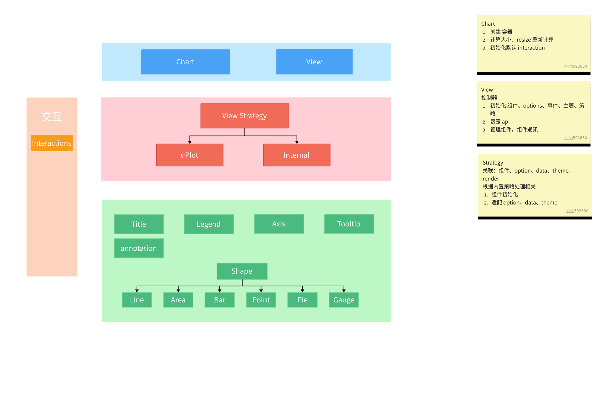

# Chart

> 用于提供创建 svg、自适应图表大小等配置, 继承于 View，有着 View 的 api

## 职责

- 设置主题
- 初始化 interaction
- 图表宽高自适应事件绑定
- destroy

持续更新...


## 结构

```
chart
├─ README.md
├─ docs // 文档
├─ package.json
├─ src
│  ├─ chart
│  │  ├─ event-emitter.ts
│  │  ├─ index.ts // 图表 chart view 容器
│  │  └─ view.ts // 视图 view 
│  ├─ components // 图表相关组件
│  │  ├─ annotation.ts // 标注
│  │  ├─ axis.ts // 坐标轴
│  │  ├─ base.ts // 组件抽象类
│  │  ├─ coordinate.ts // 坐标系
│  │  ├─ header.ts 
│  │  ├─ index.ts // 注册组件相关
│  │  ├─ legend.ts // 图例
│  │  ├─ scale.ts // 比例尺 度量
│  │  ├─ shape // 图形
│  │  │  ├─ area.ts // 面积
│  │  │  ├─ bar.ts // 柱状图
│  │  │  ├─ gauge.ts // 计量图
│  │  │  ├─ index.ts // 图形注册等相关
│  │  │  ├─ line.ts // 线图
│  │  │  ├─ pie.ts // 饼图
│  │  │  └─ point.ts // 点图
│  │  ├─ styles.ts // 组件公共样式
│  │  ├─ title.ts // 标题
│  │  └─ tooltip.ts // 工具提示
│  ├─ index.ts // 图表base 注册组件、图形、等
│  ├─ interaction // 交互
│  │  ├─ action // 交互动作
│  │  │  ├─ action.ts // action 基类
│  │  │  ├─ brush-x.ts // x 框选
│  │  │  ├─ element.ts // 元素激活
│  │  │  ├─ index.ts // 注册 action 相关
│  │  │  ├─ legend.ts // 图例切换
│  │  │  └─ tooltip.ts // 图例展示隐藏
│  │  ├─ index.ts // 注册交互动作相关
│  │  └─ interaction.ts // 交互
│  ├─ reactivity // 响应式 option 
│  ├─ strategy // uplot internal策略
│  │  ├─ abstract.ts // 抽象类
│  │  ├─ config.ts // 默认配置文件
│  │  ├─ index.ts
│  │  ├─ internal-strategy.ts // 内置策略  d3 渲染图表
│  │  ├─ manage.ts // 策略管理
│  │  ├─ quadtree.ts // uplot 使用 Quadtree组件
│  │  ├─ uplot-strategy.ts // uplot 策略 uplot 渲染图表
│  │  └─ utils.ts // 工具函数
│  ├─ theme // 主题
│  │  ├─ dark.ts // 深色主题
│  │  ├─ index.ts
│  │  └─ light.ts // 浅色主题
│  ├─ types // 类型文件
│  └─ utils // 工具函数
├─ stories // demo
├─ tsconfig.json
└─ yarn.lock
```

## Api

> 命令式：同时支持 options 配置

```ts
const chart = new Chart({
  container: 'chart',
  data: [],
  options: Options, // 所有配置集合
});

// 设置图标宽高 根据容器大小动态更新
chart.changeSize({ width, height });

// 命令式
chart.data([])
chart.title(option)
chart.legend(option)
```

## Option

```ts
interface ChartOption {
  // 绘制的 DOM 可以是 DOM select  也可以是 DOM 实例
  container: string | HTMLElement;
  // 图表宽高度 不设置默认根据父容器高度自适应
  width?: number;
  height?: number;
  // 图表内边距 上 右 下 左  不包含 header
  padding?: Padding; // [16,0,0,0]
  // 默认交互 ['tooltip', 'legend-filter', 'legend-active']
  defaultInteractions?: string[];
  // 图表组件等相关的配置。同时支持配置式 和 声明式
  options: Options
  /** 主题 */
  theme?: Theme; // 默认根据系统
}

// 具体图表设置
interface Options {
  // 只读所有配置反应在次类型上
  readonly padding?: Padding;
  readonly data?: Data;

  title?: TitleOption; // 图表标题
  legend?: LegendOption; // 图例
  tooltip?: TooltipOption; // 工具提示
  
  scale?: { // 度量｜比例尺 将数据映射像素上
    x?: ScaleOption;
    y?: ScaleOption;
  };
  axis?: { // x y 坐标轴
    x?: AxisOption;
    y?: AxisOption;
  };
  coordinate?: CoordinateOption; // 坐标系 (将不同类型图表统一配置)
  annotation?: AnnotationOption; // 标注 xLine yLine
  // shape 相关
  line?: LineShapeOption; // 线
  area?: AreaShapeOption; // 面积图
  bar?: BarShapeOption; // 柱状图
  point?: PointShapeOption; // 点图
  pie?: PieShapeOption; // 饼图
  gauge?: GaugeShapeOption; // 计量图
}
```
